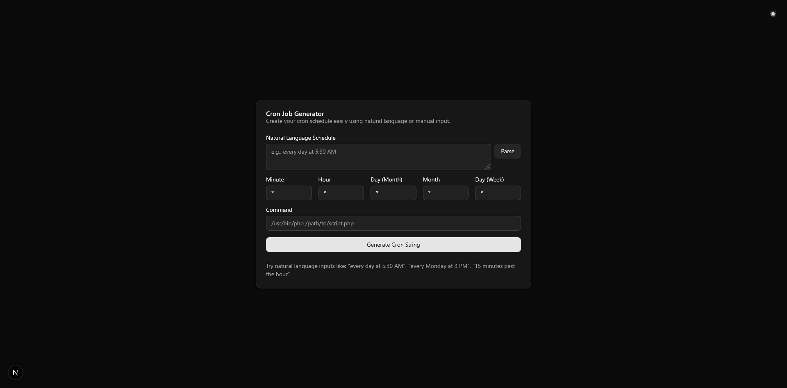

# Cronie - Cron Job Generator

Cronie is a modern web application that makes it easy to create cron job schedules using natural language input. Built with Next.js, Shadcn UI, and TypeScript, it offers an intuitive interface for generating cron expressions without having to remember cryptic syntax.



## Features

- **Natural Language Parsing**: Enter schedules using everyday language like "every second Sunday" or "daily at 5:30 AM"
- **Interactive UI**: Real-time feedback as you build your cron schedule
- **Manual Controls**: Fine-tune each cron field (minute, hour, day, month, weekday)
- **Dark Mode Support**: Work comfortably in any lighting condition with light/dark theme toggle
- **Copy to Clipboard**: Quickly copy generated cron expressions for use in your systems

## Usage

1. **Natural Language Input**: Type your schedule in plain English in the "Natural Language Schedule" field.
   - Examples: "every day at 5:30 AM", "every second Sunday", "every Monday at 3 PM", "every 15 minutes"

2. **Click Parse**: The app will analyze your input and convert it to the appropriate cron fields.

3. **Fine-tune (if needed)**: You can manually adjust any of the cron fields.

4. **Generate Cron String**: Click the button to generate the final cron string.

5. **Copy**: Use the copy button to copy the cron expression to your clipboard.

## Supported Patterns

Cronie can understand various scheduling patterns, including:

- Time intervals: "every X minutes", "every X hours", "hourly"
- Daily schedules: "daily", "every day at [time]"
- Weekly schedules: "weekly", "every week on [day]"
- Monthly schedules: "monthly", "every month on the [day]"
- Ordinal patterns: "every first/second/third/fourth [weekday]"
- Specific times: "at 5:30 PM", "3:45 AM"

## Development

### Prerequisites

- Node.js (v18 or higher recommended)
- npm or yarn

### Setup

1. Clone the repository:
   ```bash
   git clone https://github.com/yourusername/cronie.git
   cd cronie
   ```

2. Install dependencies:
   ```bash
   npm install
   # or
   yarn install
   ```

3. Run the development server:
   ```bash
   npm run dev
   # or
   yarn dev
   ```

4. Open your browser and navigate to:
   ```
   http://localhost:3000
   ```

## Tech Stack

- **Next.js**: React framework with App Router
- **TypeScript**: For type safety and better developer experience
- **Tailwind CSS**: For styling
- **Shadcn UI**: For UI components
- **next-themes**: For theme management
- **chrono-node**: For natural language date/time parsing

## License

MIT

## Contributing

Contributions are welcome! Feel free to open issues or submit pull requests to help improve Cronie.

1. Fork the repository
2. Create your feature branch (`git checkout -b feature/amazing-feature`)
3. Commit your changes (`git commit -m 'Add some amazing feature'`)
4. Push to the branch (`git push origin feature/amazing-feature`)
5. Open a Pull Request
